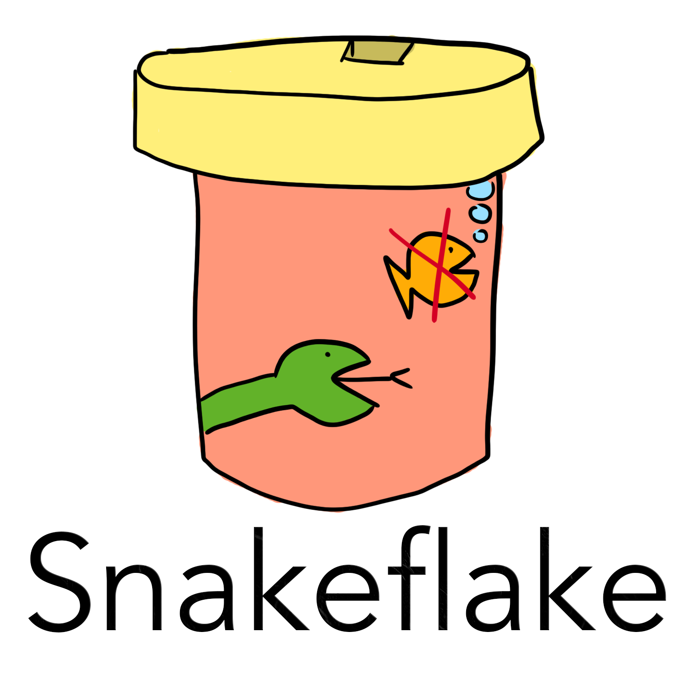

# Snakeflake


Snakeflake is a discrete nonserial ID generator like [Snowflake](https://github.com/twitter-archive/snowflake) and [Sonyflake](https://github.com/sony/sonyflake), implemented in Python.

"Discrete" and "nonserial" are real words. I promise.



## Usage
```py
>>> import datetime
>>> from snakeflake.snakeflake import SnakeflakeGenerator
>>> from snakeflake.config import SnakeflakeGeneratorConfig
>>> 
>>> # Set the epoch to 5:30, 28 March 2010 and the machine ID to 283
>>> config = SnakeflakeGeneratorConfig(datetime.datetime(2010, 3, 28, 5, 30), 283)
>>> # Create the Snakeflake Generator
>>> sf = SnakeflakeGenerator(config)
>>> # Generate some Snakeflake IDs
>>> sf.next_id()
526063632593715483
>>> sf.next_id()
526063667423281435
>>> # Not specifying a Machine ID will generate one from your internal IP address 
>>> config = SnakeflakeGeneratorConfig(datetime.datetime(2010, 3, 28, 5, 30), None)
>>> config.machine_id
1
```

## Installation

Eh maybe later.

## To do:
 - [ ] Better Documentation
 - [x] ~~Add an icon~~
 - [ ] Add a better icon
 - [ ] Accept a function as a parameter to get the current machine id
 - [ ] Accept a function as a parameter to check the uniqueness of the machine id
 - [ ] Async support (if I decide to do the above)
 - [x] Add tests(!!!)
 - [x] Add a snakeflake decoder
 - [ ] Publish (🎉🎉🎉)

## Contributing

Want to contribute to this project? Feel free to submit a PR!

## License

This project is licensed under the Apache 2.0 license.